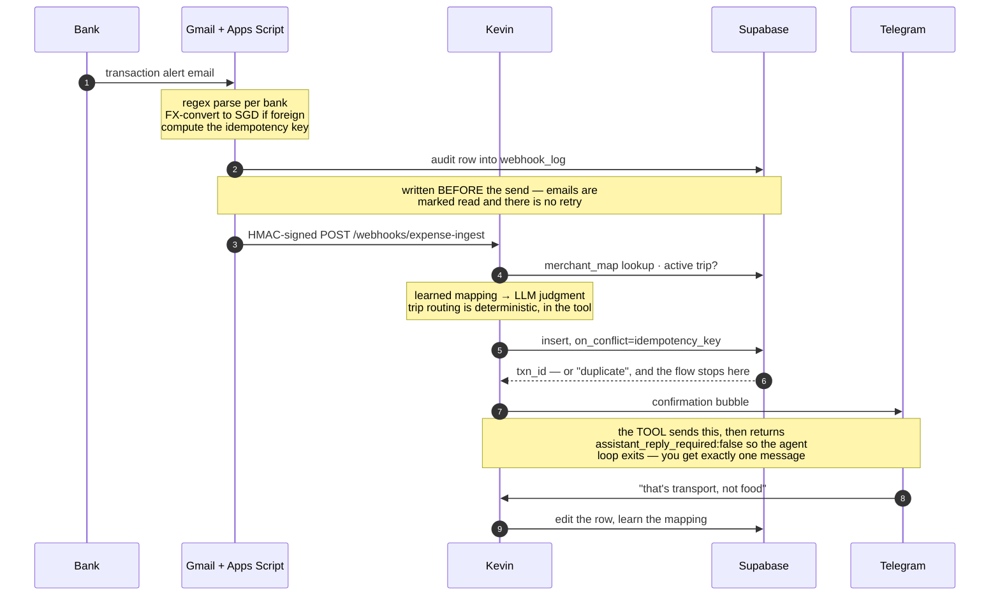

# Architecture

How the pieces fit, what each skill owns, and what the stack is. The [README](../README.md) has the short version; [AGENTS.md](../AGENTS.md) has the rules for changing any of it.

## How one purchase becomes a row

Roughly five minutes, most of it Gmail's polling interval. The ordering matters more than the boxes: the audit row is written *before* the webhook fires, the dedup can stop the flow dead, and the confirmation is sent by the tool rather than the model.



A weekly sweep diffs `webhook_log` against the ledger, so anything that fell out between the POST and the ledger insert gets reported rather than lost.

---

## The pieces

```
                     Inputs
          ┌────────────┴─────────────┐
          │                          │
   Gmail Apps Script             Telegram
   (HMAC webhook,                 bot
    audit-first, paced)             │
          └────────────┬────────────┘
                       ▼
       ┌────────────────────────────────┐
       │        System prompt           │
       │  SOUL.md (+ memory files)      │  ← tier-2
       │              +                 │
       │  Active skill markdown         │  ← one of five, versioned;
       │              +                 │    the webhook lane gets a slim one
       │  37 registered tools           │  ← per-platform allow-list
       └────────────────┬───────────────┘
                        ▼
            LLM (any OpenAI-compatible
             endpoint — swap via config)
                        │
        ┌───────────┬───┴────────┬─────────────┐
        ▼           ▼            ▼             ▼
   Supabase      Telegram     Cron jobs    Google Sheet
   Postgres      (replies,    (6 SGT       (optional nightly
   (ledger,       nudges)      schedules)   export, human view)
    15 tables,
    RLS)
        │
        ▼
   Dashboard (PWA: email-OTP auth, RLS reads,
   sample-data mode when opened from disk)
```

### The three tier-2 files

Small on purpose. `MEMORY.md` carries an explicit *"what does NOT belong here"* list and each template opens with a note on what to keep out: transaction data, derived insights, budget numbers and category lists live in the database, never in the prompt.

| File | Contents | Why it's separate |
|---|---|---|
| [`SOUL.md`](../hermes-config/SOUL.md.example) (~50 lines) | Voice, principles, failure modes | Anchors the persona so the agent feels like *one thing* across skills |
| [`USER.md`](../hermes-config/USER.md.example) | People, payment methods, communication rules | Things the model needs to know about *you* that don't change week to week |
| [`MEMORY.md`](../hermes-config/MEMORY.md.example) | Schema, webhook payload shape, enums, edge-case quirks | Machine-ish reference — answers "how does this system work" questions |

They ship as `.example` templates and are gitignored under their real names, so a filled-in `USER.md` can't be committed to *this* repo by accident — which also means your fork needs them added with `git add -f` before the first build, or the Dockerfile's COPY fails (SETUP says exactly how). One honest caveat, discovered during the 0.21 upgrade and documented rather than hidden: hermes reads `USER.md` and `MEMORY.md` from the *persistent disk*, not from where the Dockerfile copies them — so only `SOUL.md` loads from the image. The templates say how to make the other two live.

### Skills, tools, storage

- **Skills** are versioned markdown files in [`skills/`](../skills/): `expense-tracker` (categorisation, travel routing, trips/pots, lending, the silence contract), `expense-ingest` (a slim webhook-only subset, the only skill the ingest route loads — a token diet, mirror-locked to its parent), `card-optimiser`, `budget-manager`, `weekly-summary`. The active skill defines the playbook; tier-2 stays constant across them. Slash commands (`/log`, `/undo`, `/budget`, `/summary`) are registered by four small bundle files in `hermes-config/skill-bundles/` — plain text works without them.
- **Tools** are Python functions registered imperatively in [`tools/expense_sheets_tool.py`](../tools/expense_sheets_tool.py) (no decorator — the registry is injected by hermes-agent at runtime and stubbed in tests). They reach the model through the per-platform allow-lists in [`cli-config.yaml`](../hermes-config/cli-config.yaml): a platform whose list omits `expense_tracker` sees none of them and says nothing about it — one of the named mistakes in [`AGENTS.md`](../AGENTS.md).
- **Storage** is Supabase Postgres behind [`tools/supabase_client.py`](../tools/supabase_client.py) (stdlib urllib, no SDK); [`tools/sheets_client.py`](../tools/sheets_client.py) holds the optional export path and the idempotency formula. Schema in [`supabase/migrations/`](../supabase/migrations/) — eight numbered files, append-only — consolidated into [`supabase/schema.sql`](../supabase/schema.sql) so a fresh install is one paste.

---

## Skills

### `expense-tracker` — the conversational core

Owns bank-email parses, manual logging, receipt photos, reply-to-message edits, travel-mode routing, trip pots, and lending.

| Trigger | Behaviour |
|---|---|
| Webhook delivers a parsed bank email | MerchantMap lookup → LLM judgment → log → Telegram bubble (trip routing happens inside the tool) |
| User: *"$8 lunch at Toast Box"* | Same flow, manually triggered |
| User replies to a confirmation: *"that's transport not food"* | Resolves the `txn_id` via `telegram_message_id`, edits the row, learns the mapping |
| Foreign-currency txn during an active trip | Auto-routes to the trip budget with a `[bucket:X]` tag; 80%/100% bucket alerts |
| User: *"Alex owes me $20"* | Preview-then-confirm IOU; the nightly sweep completes the ledger when it's repaid |
| User: *"undo"* | Preview-then-confirm removal of the last transaction |

### `expense-ingest` — the same flow, on a diet

The webhook route loads this and only this: the categorisation order, the multi-category merchant list, the silence contract, the travel rules — nothing else. Every edit to those sections of `expense-tracker` is mirrored here in the same commit; the repo's operating manual treats that mirror as a contract.

### `card-optimiser` — miles & rewards

Cap tracking on the statement-cycle clock, bonus caps on the calendar clock, two-pool tracking for cards that split their cap, recommendations, min-spend and wrong-card steering nudges, promo overrides with lazy expiry, post-cap nudges fired from inside `log_expense`. Gated: all card tools return `setup_required` until card data exists, and the rest of the agent works untouched.

### `budget-manager` — burn-down warnings

Cron-invoked prompt variant over the same toolset: the evening review's attention block (variable categories over 80%, fixed bills over their usual), natural-language reallocation, the *"can I afford X?"* calculator.

### `weekly-summary` — reports

Friday summary with a "cards this month" section; 1st-of-month final report + miles scorecard. (Subscription-creep detection lives in `expense-tracker` and the dashboard; no cron calls it.)

### Repo-side skills (Claude Code, never shipped)

A different species: workflows in [`.claude/skills/`](../.claude/skills/) run by a human against the checkout, not by the deployed agent. Each is a markdown checklist, readable without Claude Code.

| Skill | What it does |
|---|---|
| `/statement-recon` | Runs the [`recon/`](../recon/) CLI — checksum-gated PDF parsers that diff monthly e-statements against the ledger — and helps triage the diff |
| `/card-tnc-review` | Quarterly re-verification of card T&Cs against official issuer sources; hash-skips unchanged sources |
| `/new-alert-source` | The eight-step checklist for onboarding a new alert email source: parser, byte-for-byte Python mirror, parity pins, deploy note |

---

## Tech stack

| Layer | Choice |
|---|---|
| Agent framework | [hermes-agent](https://github.com/NousResearch/hermes-agent) 0.21.0, pinned by SHA, two build-time patches, weekly upstream check |
| LLM | Any OpenAI-compatible endpoint (a nano-class model handles it — categorisation is not a frontier problem) |
| Ledger | Supabase Postgres (free tier), RLS-locked, 15 tables |
| Human view / backup | Google Sheet, rebuilt nightly by the agent — **optional** |
| Dashboard | Two-page PWA — no framework, no build step, dependencies vendored |
| Ingress | Telegram bot + Gmail Apps Script (HMAC-signed webhook, audit-before-send, paced) |
| Egress | Telegram + 6 cron schedules (wall-clock in the container's timezone) |
| Deploy | Docker on Render (Singapore), about USD 7 a month for the box; LLM usage is metered on top |
| Tests | pytest, a couple of seconds, no network; CI on every push |
